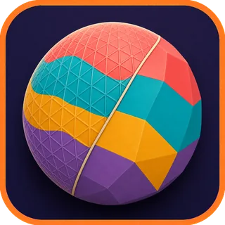
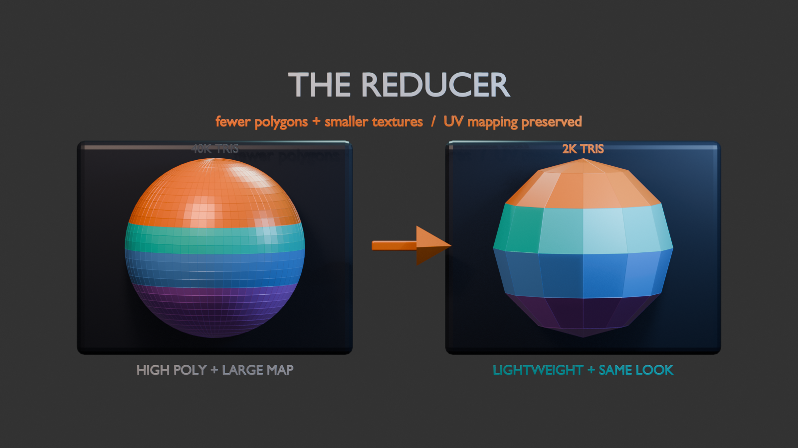
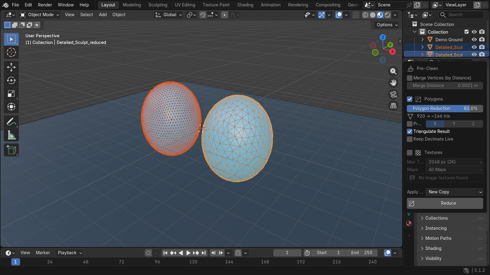

  

# The Reducer — Blender add-on

Lower a mesh's **polygon count** and shrink its **texture maps** while keeping the
**UV texture mapping intact** — everything keeps landing on the exact same places,
just at lower resolution.

*Reduce geometry and texture size together while keeping the model's UV-mapped appearance in place.*

## Actual add-on in Blender

*Actual Blender capture after the add-on created a separate reduced copy: the dense original stays on the left, while the 82%-reduced result and live triangle estimate are visible on the right.*

It's a **separate extension** from *Painted 3MF Export* (its own zip / entry in
Preferences); the two don't depend on each other.

---

## Why the mapping is preserved

UV coordinates are normalized `0..1` values stored per face-corner, independent of
both image resolution and polygon density:

- **Texture size** — a 4096² and a 1024² image are sampled by the *exact same* UVs.
  Shrinking the image changes detail, never *where* it lands. UVs are untouched.
- **Polygon count** — the Decimate **Collapse** modifier interpolates and carries
  the UVs along with the surviving vertices, so the texture keeps mapping to the
  same surfaces.

---

## Install

1. Blender 4.2+ / 5.x: **Edit ▸ Preferences ▸ Get Extensions ▸ ▾ ▸ Install from Disk…**
   and pick `the_reducer-1.2.0.zip` (or drag the zip into the Blender window).
2. Enable it if it isn't already.

No external dependencies.

## Use

1. Select your mesh (make it the **active** object).
2. Open the **N-panel** in the 3D Viewport → **"Reducer"** tab.
3. Set the **Polygon Reduction %** and the **Max Texture Size**.
4. Click **Reduce**.

By default it produces an independent copy `<name>_reduced` and leaves your
original untouched.

## Settings

| Setting | Meaning |
|---|---|
| **Merge Vertices (by Distance)** | *(Pre-Clean)* Weld duplicate / near-coincident vertices **before** reducing, at the given **Merge Distance**. Cleans up split-vertex exports (CAD, photogrammetry, some GLB/FBX) so Decimate collapses evenly. UVs are untouched |
| **Instant Clean** | *(Pre-Clean; shown only when the [Instant Clean](https://blendermarket.com/products/instant-clean) add-on is installed)* Run Instant Clean's **Clean** command on the object before reducing, using the settings from Instant Clean's own panel |
| **Reduce Polygons** | Toggle mesh decimation on/off |
| **Method** | *(shown only when Exoside's [Quad Remesher](https://exoside.com/quadremesher/) add-on is installed)* **Decimate** — collapse edges, fast, triangles out; or **Quad Remesher** — rebuild clean quad topology with the external engine, then transfer the original UVs onto it |
| **Polygon Reduction** | Percent of triangles to remove (`60%` keeps 40%). Live readout shows current → projected face count (for Quad Remesher, the projected target quad count) |
| **Transfer UVs** | *(Quad Remesher method only)* Quad Remesher output has no UVs; copy the original mesh's UV layout onto the new topology (Data Transfer, nearest-face interpolated) so textures keep mapping to the same surfaces |
| **Preserve Symmetry** | Collapse symmetrically across X/Y/Z so a mirrored model stays mirrored |
| **Triangulate Result** | Keep the collapsed geometry triangulated (recommended for 3D-print / 3MF) |
| **Keep Decimate Live** | Leave the Decimate as an *unapplied* modifier so you can fine-tune the ratio in the Modifier panel instead of baking it now |
| **Reduce Textures** | Toggle texture down-scaling on/off |
| **Max Texture Size** | Cap the longest edge (`4096 / 2048 / 1024 / 512 / 256`). Smaller images are never upscaled; non-square images keep their aspect |
| **Maps** | Resize **All Maps** (base color, roughness, normal, …) or **Base Color Only** |
| **Apply To** | **New Copy** (`<name>_reduced`, original untouched) or **Active Object** (rewires its materials to the reduced textures) |

## Quad Remesher method

When Exoside's **Quad Remesher** add-on is installed and enabled, a **Method**
selector appears in the Polygons section. Picking *Quad Remesher*:

- Computes the target quad count from your **Polygon Reduction %** (a quad ≈ 2
  triangles) and hands it to the engine. **Symmetry** maps to the engine's
  X/Y/Z symmetry. Every other engine setting (adaptive size, hard edges, …) is
  taken from the Quad Remesher panel as you configured it there.
- The engine runs **in the background** — the Reduce button returns immediately
  and a status line under it shows progress. When the retopo lands, The Reducer
  finishes the job: transfers the original UVs onto the new topology (Quad
  Remesher output has none), triangulates if requested, applies **New Copy /
  Active Object** semantics, and reduces textures.
- One remesh runs at a time, and a licensed/activated Quad Remesher engine is
  required (run it once from its own panel first if you never have).
- Because the run is asynchronous, it isn't a single undo step — use **New
  Copy** (the default) to keep the original safe.

## Pre-Clean

The **Pre-Clean** section at the top of the panel runs before any reduction, in
the order shown:

1. **Merge Vertices (by Distance)** — a `remove_doubles` weld. Runs on the
   target object (the copy in *New Copy* mode), so the original is never touched.
2. **Instant Clean** — invoked only if that add-on is installed *and* the box is
   checked; it cleans per your Instant Clean settings.

The reduction percentage applies to the *cleaned* triangle count. With the
**Quad Remesher** method, the engine remeshes the *original* object, so
pre-clean runs only in **Active Object** mode there (in *New Copy* mode it is
skipped and the report says so).

## Notes

- Each reduced texture is a **new packed image** (`<name>_reduced`) embedded in
  the `.blend`, so the change persists on save/reload. Your original images —
  and any external files they came from — are never modified.
- Very aggressive polygon reduction can smear the texture near UV-island seams;
  moderate reductions (40–60%) stay clean.
- Decimate Collapse keeps a watertight mesh watertight — good for the 3MF pipeline,
  but eyeball the result before printing after heavy reduction.

## License

GPL-3.0-or-later.
